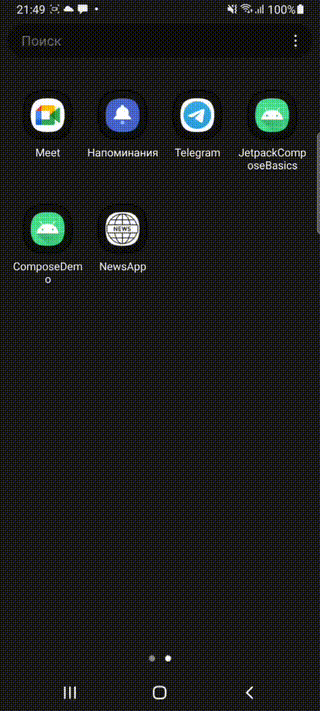

# News Application - Jetpack Compose Practice

This application designed for hands-on practice with Jetpack Compose & Compose Navigation.

### Getting started

To get started with app, follow these steps:

1. Clone the Repository.
2. Set up api key in build.gradle.kts: Replace **'value = "\"b74bf7ed56b84d229be67602aa3f5c98\""'**
   with your actual API key in **buildConfigField**.
3. Build and run.

### Features

* **News articles**: Users can watch latest news.
* **Search with search history**: Search history is saved in the database.
* **Save favourite articles**: Users can save their favourite articles to check it later.

### Previews 📷

   
   

